# Fingerprint Verification on SOCOFing

This project builds a full fingerprint biometric verification pipeline on the SOCOFing dataset with a strict 70/15/15 identity-disjoint split, classical fingerprint enhancement, augmentation and hyperparameter search, two lightweight metric-learning models, and biometric evaluation with FAR, FRR, and EER. The canonical dataset root is `archive/SOCOFing`; the duplicated lowercase tree is ignored.

The code is optimized for a 4 GB RTX 3050 laptop GPU. The balanced run uses mixed precision, small encoders, identity-balanced batches, and a compact search space that still covers the full 5 x 2 model-feature comparison requested.

# fingerprint


## Best Balanced-Run Result

- Best model: `compact_siamese`
- Best feature pipeline: `raw`
- Best augmentation: `none`
- Best hyperparameters: learning rate `3e-4`, batch size `48`, margin `0.75`
- Test EER: `0.00145`
- Test accuracy at the EER threshold: `0.99847`

## Phase Walkthrough

### Phase 1: Baseline and Overfitting Check

The baseline trains a compact Siamese encoder on raw prints with no augmentation and tracks training versus validation loss to expose memorization. The loss curve below is generated automatically during the benchmark run.

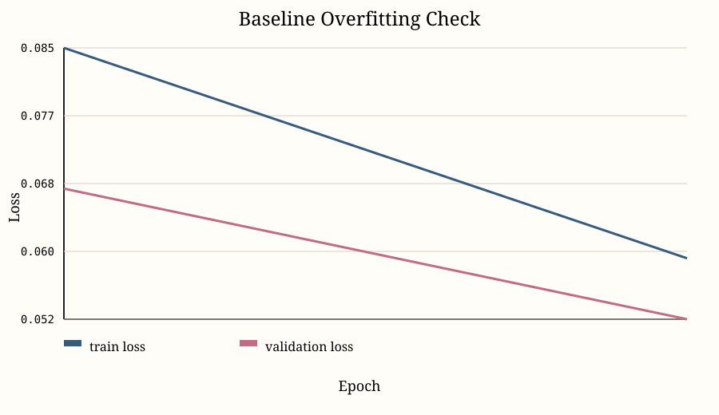

### Phase 2: Classical Fingerprint Enhancement

The project implements all requested enhancement stages: global block-wise segmentation, adaptive intensity normalization, ridge orientation estimation, orientation-selective Gabor filtering, binarization, and thinning.

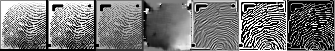

Raw input:

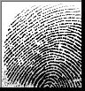

Segmented foreground:

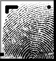

Adaptive normalization:

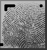

Orientation field:

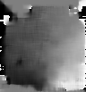

Gabor enhancement:

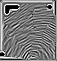

Binarization:

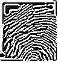

Thinning:

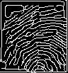

### Phase 3: Augmentation Search

All requested augmentation families are implemented and benchmarked on the validation set: rotation, elastic deformation, random obliteration, and the combined schedule. On this dataset and training budget, no augmentation performed best; the strongest augmentation schedule was still slightly worse than the raw training distribution.

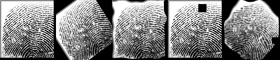

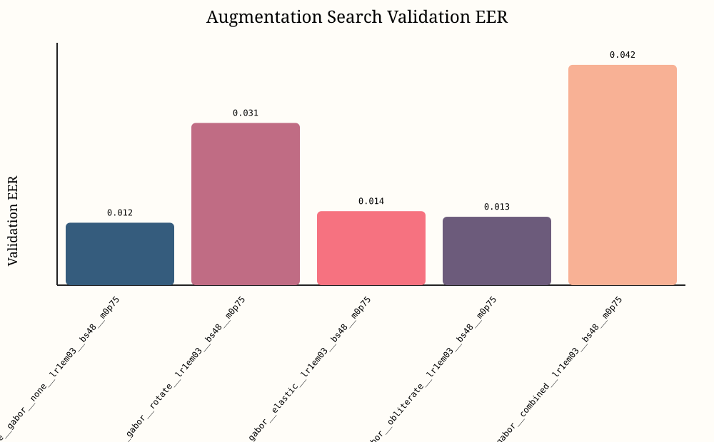

### Phase 4: Deep Learning Models

Two deep-learning verification models are evaluated for each feature variant.

- `compact_siamese`: a compact CNN trained with batch contrastive loss.
- `mobile_triplet`: a depthwise-separable encoder trained with batch-hard triplet loss.

Both models emit `R^128` embeddings and are compared on the same split and evaluation protocol.

### Phase 5: Biometric Evaluation

The project ranks experiments with biometric metrics instead of plain classification accuracy.

- FAR: impostor acceptance probability.
- FRR: genuine rejection probability.
- EER: the threshold where FAR and FRR match.

The best run ROC trace is saved below.

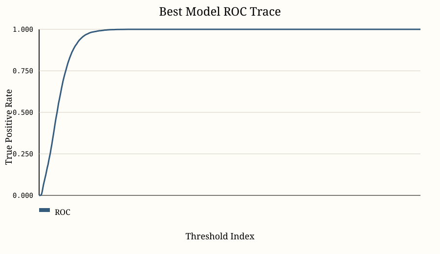

## Final 10-Way Comparison

The final benchmark evaluates all 5 preprocessing variants against both models.

| Rank | Model | Feature Pipeline | Test EER | Test Accuracy |
| --- | --- | --- | ---: | ---: |
| 1 | `compact_siamese` | `raw` | 0.00145 | 0.99847 |
| 2 | `compact_siamese` | `normalized` | 0.00317 | 0.99689 |
| 3 | `compact_siamese` | `segmented` | 0.00611 | 0.99399 |
| 4 | `compact_siamese` | `gabor` | 0.00861 | 0.99130 |
| 5 | `mobile_triplet` | `raw` | 0.00978 | 0.99040 |
| 6 | `mobile_triplet` | `segmented` | 0.01022 | 0.98958 |
| 7 | `compact_siamese` | `skeleton` | 0.01139 | 0.98844 |
| 8 | `mobile_triplet` | `normalized` | 0.01215 | 0.98773 |
| 9 | `mobile_triplet` | `gabor` | 0.01535 | 0.98469 |
| 10 | `mobile_triplet` | `skeleton` | 0.02684 | 0.97295 |

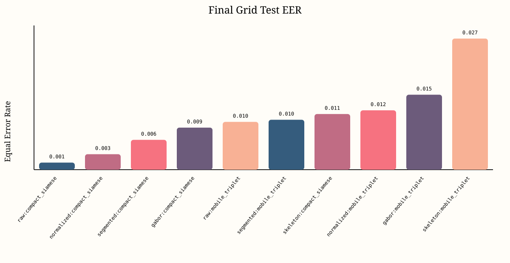

## Execution Flow

- `00_main.py` builds the run profile and launches the full benchmark.
- `src/p12_experiment_runner.py` runs the baseline, augmentation sweep, hyperparameter search, and the final 10-combination grid.
- `src/p04_phase_one_split.py` indexes SOCOFing, enforces identity-disjoint splits, and builds balanced identity batches.
- `src/p05_phase_two_preprocessing.py` performs segmentation, normalization, orientation estimation, Gabor filtering, binarization, and thinning.
- `src/p06_phase_three_augmentation.py` applies rotation, elastic deformation, and random obliteration.
- `src/p07_phase_four_models.py`, `src/p08_metric_learning.py`, and `src/p09_training.py` define the models, losses, and training loop.
- `src/p10_phase_five_evaluation.py` computes FAR, FRR, and EER from pairwise distances.
- `src/p11_visualization.py` writes the phase images and SVG charts used in this README.

## Run It

Balanced benchmark:

```bash
python3 00_main.py --profile balanced
```

Smoke validation:

```bash
python3 00_main.py --profile smoke
```

Tests:

```bash
pytest
```

You can also use the helper scripts:

```bash
./scripts/run_pipeline.sh
./scripts/test.sh
```

## Artifacts

- Full benchmark summary: `artifacts/summaries/pipeline_summary.json`
- Split manifest: `artifacts/splits/identity_split.csv`
- Model checkpoints: `artifacts/checkpoints/`
- Detailed narrative: `docs/story.md`